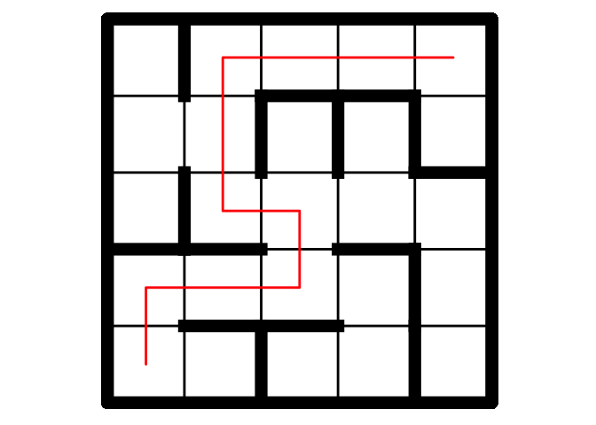

maze
================

[](https://travis-ci.org/ddiez/maze) [](https://codecov.io/gh/ddiez/maze)

Installation
------------

You can install `maze` from github with:

``` r
devtools::install_github("ddiez/maze")
```

Usage
-----

``` r
library(maze)
set.seed(123)
g <- make_maze(5, 5)
plot_maze(g, tile.show = TRUE, path.show = TRUE)
```


